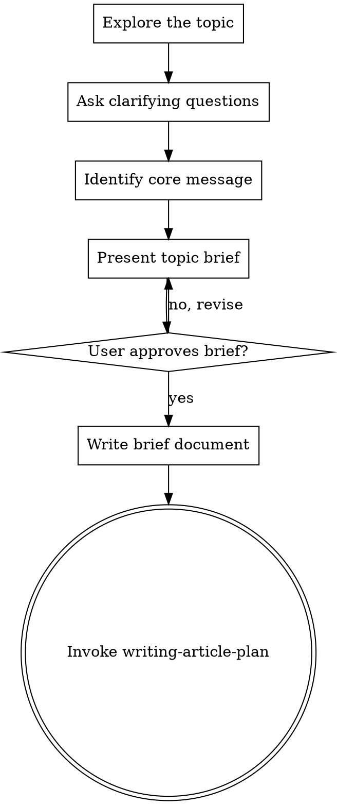

# Brainstorming Ideas Into Article Briefs

## Overview

Help turn rough ideas into focused article briefs through natural collaborative dialogue.

Start by understanding what the user wants to write about, then ask questions one at a time to refine the concept. Once you understand the topic, present the brief and get user approval.

<HARD-GATE>
Do NOT invoke writing-article-plan, write any content, create any outline, or take any writing action until you have presented a topic brief and the user has approved it. This applies to EVERY writing project regardless of perceived simplicity.
</HARD-GATE>

## Anti-Pattern: "This Is Too Simple To Need A Brief"

Every writing project goes through this process. A short blog post, a single-page doc, a quick update — all of them. "Simple" articles are where unclear messaging causes the most wasted effort. The brief can be short (a few sentences for truly simple pieces), but you MUST present it and get approval.

## Checklist

You MUST create a task for each of these items and complete them in order:

1. **Explore the topic** — understand what the user wants to write about
2. **Ask clarifying questions** — one at a time, understand audience/purpose/constraints
3. **Identify core message** — what's the ONE thing readers should remember?
4. **Present topic brief** — in sections, get user approval after each section
5. **Write brief document** — save to `docs/writing/YYYY-MM-DD-<topic>-brief.md` and commit
6. **Transition to planning** — invoke writing-article-plan skill to create article outline

## Process Flow



**The terminal state is invoking writing-article-plan.** Do NOT invoke executing-article-plan or any other writing skill. The ONLY skill you invoke after brainstorming is writing-article-plan.

## The Process

**Understanding the topic:**
- Ask what they want to write about
- Ask questions one at a time to refine understanding
- Prefer multiple choice questions when possible, but open-ended is fine too
- Only one question per message - if a topic needs more exploration, break it into multiple questions
- Focus on understanding: audience, purpose, key message, constraints

**Key questions to explore:**
- Who is the target audience? (experience level, interests, needs)
- What should readers think/feel/do after reading?
- What's the main message in one sentence?
- Any length/format requirements?
- Tone preference? (formal/casual/technical/friendly)
- Any existing materials to reference?

**Presenting the brief:**
- Once you believe you understand the topic, present the brief
- Cover these sections concisely:
  - **Audience**: Who is reading this
  - **Purpose**: What you want to achieve
  - **Core Message**: The ONE thing readers should remember
  - **Key Points**: 2-4 supporting arguments
  - **Tone & Style**: How it should feel
  - **Constraints**: Length, format, deadlines
- Ask after presenting whether it looks right
- Be ready to revise if something doesn't align

## After the Brief

**Documentation:**
- Write the validated brief to `docs/writing/YYYY-MM-DD-<topic>-brief.md`
- Use clear, concise language
- Commit the brief document

**Planning:**
- Invoke the writing-article-plan skill to create a detailed article outline
- Do NOT invoke any other skill. writing-article-plan is the next step.

## Brief Template

```markdown
# [Topic] - Article Brief

**Date**: YYYY-MM-DD

## Audience
[Who will read this? Experience level, interests, pain points]

## Purpose
[What should readers gain? What action should they take?]

## Core Message
[The ONE sentence that captures your main point]

## Key Points
1. [Supporting argument/section 1]
2. [Supporting argument/section 2]
3. [Supporting argument/section 3]

## Tone & Style
[Formal/casual/technical/conversational - with examples]

## Constraints
- **Length**: [target word count]
- **Format**: [blog post/technical doc/report/guide]
- **Deadline**: [if applicable]

## References
[Any existing materials, sources, or inspiration]
```

## Key Principles

- **One question at a time** - Don't overwhelm with multiple questions
- **Multiple choice preferred** - Easier to answer than open-ended when possible
- **Focus ruthlessly** - Every article should have ONE core message
- **Know your audience** - Different readers need different approaches
- **Validate early** - Present brief, get approval before detailed planning
- **Be flexible** - Go back and clarify when something doesn't make sense
