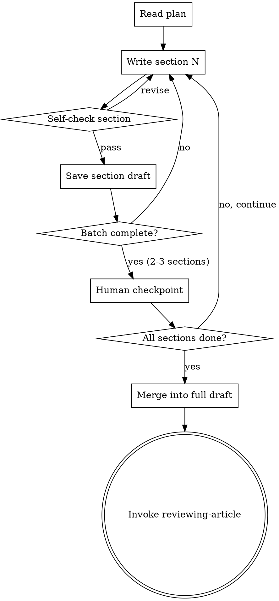

# Executing Article Plans

## Overview

Execute an approved article plan by writing each section according to the outline. Work section by section, validate each piece, then continue. Human checkpoints every 2-3 sections.

**Announce at start:** "I'm using the executing-article-plan skill to write this article."

**Context:** You should have an approved plan from writing-article-plan skill.

**Save drafts to:** `docs/writing/drafts/YYYY-MM-DD-<topic>/`

## Batch Execution Flow



## Section Writing Process

For each section:

### 1. Read Section Plan
- Review purpose, key points, evidence
- Check transition from previous section
- Note word target and tone

### 2. Write Section Content
- Start with the transition from previous section
- Develop each key point fully
- Include supporting evidence
- End with transition to next section
- Aim for word target (±10% is fine)

### 3. Self-Check
Run through these questions:
- [ ] Word count within range? (±10% of target)
- [ ] All key points covered?
- [ ] Evidence supports claims?
- [ ] Tone matches guidelines?
- [ ] Transitions smooth?
- [ ] Paragraph length appropriate? (under 4 sentences)
- [ ] Active voice used?
- [ ] No jargon without explanation?

### 4. Save Section Draft
Save to: `docs/writing/drafts/YYYY-MM-DD-<topic>/section-N-<title>.md`

Include metadata header:
```markdown
---
section: N
title: [Section Title]
word_count: XXX
status: draft
date: YYYY-MM-DD
---
```

## Batch Checkpoints

**Every 2-3 sections, pause for human review:**

Present:
```markdown
## Checkpoint: Sections N-M Complete

**Sections written:**
- Section N: [Title] (XXX words) ✓
- Section N+1: [Title] (XXX words) ✓
- Section N+2: [Title] (XXX words) ✓

**Self-check summary:**
- Word counts: [total] / [target] ([X]% of plan)
- All key points covered: ✓
- Transitions smooth: ✓
- Tone consistent: ✓

**What's next:**
- Section N+3: [Next section title]

**Your options:**
1. **Continue** - Proceed to next batch
2. **Revise** - Make changes to these sections
3. **Pause** - Stop here and review later
```

## After All Sections Complete

### Merge into Full Draft

1. Read all section files in order
2. Merge into single document
3. Add article metadata header
4. Check overall flow
5. Save to: `docs/writing/YYYY-MM-DD-<topic>-draft.md`

**Full draft header:**
```markdown
---
title: [Article Title]
date: YYYY-MM-DD
status: draft_complete
word_count: XXXX
target_word_count: XXXX
sections: N
---

# [Article Title]

[Merged content...]
```

### Transition to Review

**After saving full draft:**

"Full draft complete! Saved to `docs/writing/YYYY-MM-DD-<topic>-draft.md`

**Draft stats:**
- Total words: XXXX (target: XXXX)
- Sections: N
- Tone: [as specified]

**Next step:** Invoke reviewing-article skill for multi-pass review (logic → evidence → flow → polish)

Ready to proceed with review?"

**If yes:**
- **REQUIRED SUB-SKILL:** Use document-superpowers:reviewing-article

## Quality Standards

**Good section writing:**
- Clear topic sentence
- Key points well-developed
- Evidence integrated naturally
- Smooth transitions
- Appropriate word count
- Consistent tone

**Warning signs:**
- Vague claims without support
- Sudden topic jumps
- Overly long paragraphs
- Jargon-heavy without explanation
- Word count way off (>20% variance)

## Recovery Options

**If stuck on a section:**
1. Re-read the plan for that section
2. Skip to next section, come back later
3. Ask for clarification on unclear points
4. Suggest plan revision if needed

**If tone feels off:**
1. Review tone guidelines in plan
2. Read previous sections for consistency
3. Ask for tone example/clarification

**If running long:**
1. Check if all key points are essential
2. Tighten language (remove filler)
3. Consider splitting into two sections

## Key Principles

- **Follow the plan** - It's your blueprint
- **Self-check rigorously** - Catch issues early
- **Batch with checkpoints** - Don't write everything without review
- **Save incrementally** - Section files are your safety net
- **Transitions matter** - Each section should flow into the next
- **Word counts are guides** - ±10% is fine, 50% over is not
