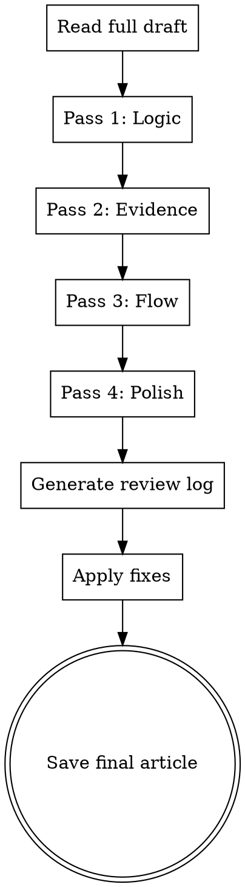

# Reviewing Articles

## Overview

Systematic multi-pass review process to ensure article quality. Each pass focuses on one dimension, making issues easier to spot and fix.

**Announce at start:** "I'm using the reviewing-article skill for systematic review."

**Context:** You should have a complete draft from executing-article-plan.

**Save outputs to:**
- Review log: `docs/writing/YYYY-MM-DD-<topic>-review.md`
- Final article: `docs/writing/YYYY-MM-DD-<topic>-final.md`

## Four-Pass Review Process



## Pass 1: Logic Check

**Focus:** Is the argument coherent and sound?

**Questions to ask:**
- [ ] Does the introduction clearly state the core message?
- [ ] Does each section support the core message?
- [ ] Do conclusions follow logically from premises?
- [ ] Are there any logical fallacies?
- [ ] Are there contradictions between sections?
- [ ] Does the conclusion tie everything together?

**Common issues:**
- Thesis buried or unclear
- Sections don't support main argument
- Circular reasoning
- Non-sequiturs
- Contradictory claims

**Log format:**
```markdown
### Pass 1: Logic Check

**Issues Found:**

**[CRITICAL]** Section 3, paragraph 2
- **Issue:** Conclusion doesn't follow from premise
- **Current:** "X is true, therefore Y must be false"
- **Problem:** X and Y aren't mutually exclusive
- **Fix:** Revise to show relationship between X and Y

**[MINOR]** Introduction
- **Issue:** Core message not explicit enough
- **Fix:** Add clear thesis statement at end of intro

**Strengths:**
- Section 2 builds argument methodically
- Transitions between sections are logical
```

## Pass 2: Evidence Check

**Focus:** Are claims properly supported?

**Questions to ask:**
- [ ] Does every claim have supporting evidence?
- [ ] Are sources credible and recent?
- [ ] Are statistics used correctly?
- [ ] Are examples relevant and compelling?
- [ ] Are quotes accurate and in context?
- [ ] Is the evidence sufficient for the claim?

**Common issues:**
- Unsupported assertions
- Outdated statistics
- Cherry-picked data
- Misused quotes
- Weak examples
- Missing citations

**Log format:**
```markdown
### Pass 2: Evidence Check

**Issues Found:**

**[CRITICAL]** Section 2, paragraph 3
- **Issue:** Statistic lacks source
- **Current:** "75% of users prefer..."
- **Problem:** No citation provided
- **Fix:** Add source or remove claim

**[MODERATE]** Section 4
- **Issue:** Example doesn't support point
- **Current:** Using smartphone example to illustrate enterprise software point
- **Fix:** Find relevant B2B example

**Evidence Gaps:**
- [ ] Section 1 needs concrete example of problem
- [ ] Section 3 claim about ROI needs data

**Strengths:**
- Section 2 uses case study effectively
- Research throughout is well-integrated
```

## Pass 3: Flow Check

**Focus:** Does the article read smoothly?

**Questions to ask:**
- [ ] Do paragraphs flow within sections?
- [ ] Are transitions between sections smooth?
- [ ] Is pacing appropriate? (not rushed/dragging)
- [ ] Do sentence lengths vary?
- [ ] Is paragraph length appropriate? (2-4 sentences)
- [ ] Does the reading experience feel natural?

**Common issues:**
- Abrupt topic changes
- Repetitive sentence structures
- Overly long paragraphs
- Missing transitions
- Pacing issues (too slow or too fast)

**Log format:**
```markdown
### Pass 3: Flow Check

**Issues Found:**

**[MODERATE]** Section 2 → Section 3 transition
- **Issue:** Jarring topic shift
- **Current:** Section 2 ends on implementation, Section 3 starts on strategy
- **Fix:** Add transition sentence bridging tactical → strategic

**[MINOR]** Section 1, paragraphs 2-5
- **Issue:** All paragraphs same length (3 sentences, similar structure)
- **Fix:** Vary paragraph length and structure

**Pacing Notes:**
- Introduction moves too slowly (3 paragraphs before thesis)
- Section 3 rushes through important concepts
- Conclusion feels abrupt

**Strengths:**
- Overall arc is clear
- Section 2 has excellent paragraph flow
```

## Pass 4: Polish

**Focus:** Grammar, spelling, formatting, style

**Questions to ask:**
- [ ] Any grammar/spelling errors?
- [ ] Is formatting consistent? (headers, lists, emphasis)
- [ ] Is tone consistent throughout?
- [ ] Are there unnecessary words? (very, really, just)
- [ ] Active voice used where appropriate?
- [ ] Are sentences clear and concise?

**Common issues:**
- Typos and grammar errors
- Inconsistent formatting
- Passive voice overuse
- Wordy sentences
- Filler words
- Style inconsistencies

**Log format:**
```markdown
### Pass 4: Polish

**Issues Found:**

**[MINOR]** Throughout
- 12 instances of passive voice (see marked locations)
- Inconsistent use of Oxford comma
- "Very" used 8 times (remove or strengthen word)

**Formatting:**
- Section headers: inconsistent capitalization
- Lists: mix of periods and no periods
- Code blocks: need consistent syntax highlighting

**Word Count:**
- Current: 1247 words
- Target: 1200 words
- Overrun: 47 words (4%)
- Action: Acceptable, or trim in conclusion

**Strengths:**
- Clean, professional language
- Good use of subheaders for scannability
- Technical terms explained clearly
```

## Review Log Template

```markdown
# [Article Title] - Review Log

**Date:** YYYY-MM-DD
**Reviewer:** [Your name/role]
**Draft Version:** YYYY-MM-DD-<topic>-draft.md
**Review Duration:** [time spent]

---

## Executive Summary

**Overall Assessment:** [Excellent/Good/Needs Work/Major Revision Needed]

**Critical Issues:** [count]
**Moderate Issues:** [count]
**Minor Issues:** [count]

**Estimated Fix Time:** [hours/minutes]

**Recommendation:** [Ready to publish / Needs minor fixes / Needs revision / Needs rewrite]

---

## Pass 1: Logic Check
[Details...]

## Pass 2: Evidence Check
[Details...]

## Pass 3: Flow Check
[Details...]

## Pass 4: Polish
[Details...]

---

## Priority Fix List

### Must Fix Before Publishing
1. [Issue with location and fix]
2. [Issue with location and fix]

### Should Fix (Improves Quality)
1. [Issue with location and fix]
2. [Issue with location and fix]

### Nice to Have (Optional)
1. [Issue with location and fix]

---

## Strengths to Preserve

- [What works well - don't change these]
- [Particularly effective sections/arguments]

---

## Final Checklist

- [ ] All critical issues fixed
- [ ] All moderate issues addressed or documented as accepted
- [ ] Word count within acceptable range
- [ ] Formatting consistent
- [ ] Links/references verified
- [ ] Read-through for final polish
```

## Applying Fixes

After generating review log:

1. **Present review summary to user**
2. **For each critical issue:**
   - Show current text
   - Explain problem
   - Propose fix
   - Get approval
3. **Batch minor/moderate fixes** (unless user wants granular control)
4. **Make changes to draft**
5. **Save as final version**

## Final Article Format

```markdown
---
title: [Article Title]
date: YYYY-MM-DD
status: final
word_count: XXXX
reviewed: true
review_date: YYYY-MM-DD
---

# [Article Title]

[Final polished content...]

---

## Metadata

- **Word Count:** XXXX
- **Reading Time:** ~X minutes
- **Target Audience:** [from brief]
- **Core Message:** [one sentence]
- **Published:** [where/when]
```

## Review Quality Standards

**Good review:**
- Finds real issues, not nitpicks
- Categorizes by severity accurately
- Provides actionable fixes
- Preserves what works well
- Balances critique with recognition

**Warning signs:**
- Only surface-level issues found
- Contradictory feedback
- Vague "make it better" notes
- Excessive nitpicking
- Missing critical logic flaws

## Completion

After saving final article:

**"Review complete! 📝

**Review Summary:**
- Critical issues: [X] → Fixed
- Moderate issues: [X] → Fixed
- Minor issues: [X] → Fixed

**Final article saved to:** `docs/writing/YYYY-MM-DD-<topic>-final.md`
**Review log saved to:** `docs/writing/YYYY-MM-DD-<topic>-review.md`

**Article stats:**
- Word count: XXXX
- Reading time: ~X minutes
- Status: Ready for publication

Would you like me to:
1. Export to specific format (Medium, WordPress, etc.)
2. Generate social media snippets
3. Create summary/abstract
4. Something else"**

## Key Principles

- **Four separate passes** - Don't mix concerns
- **Severity matters** - Critical blocks publication, minor doesn't
- **Document everything** - Review log is valuable reference
- **Fix systematically** - Don't ad-hoc it
- **Preserve strengths** - Don't over-edit what works
- **Evidence-based critique** - Point to specific issues, not feelings
