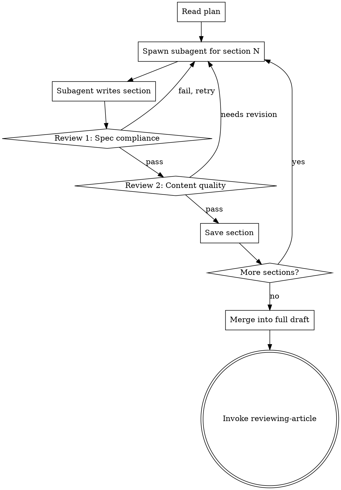

# Subagent-Driven Writing

## Overview

Dispatch a fresh subagent for each article section, review their output, iterate if needed, then continue. Faster than batch execution when you want tight feedback loops.

**Announce at start:** "I'm using subagent-driven-writing for fast iterative writing."

**Context:** Should follow an approved plan from writing-article-plan.

**Two-stage review per section:**
1. **Spec compliance** - Does it follow the plan?
2. **Content quality** - Is the writing good?

## When to Use This

**Use subagent-driven-writing when:**
- You want tight control over each section
- The article is complex or high-stakes
- You want to iterate quickly on feedback
- Sections are interdependent (later sections depend on earlier ones)

**Use executing-article-plan instead when:**
- You want to write in focused batches
- The article is straightforward
- Sections are largely independent
- You prefer fewer but longer review sessions

## The Process



## Spawning Subagents

For each section in the plan:

```markdown
**Spawning subagent for Section N: [Title]**

Task brief:
- Read plan from: docs/writing/YYYY-MM-DD-<topic>-plan.md
- Focus on: Section N ([Title])
- Write section following plan specifications
- Target word count: XXX
- Maintain tone: [from plan]
- Include all key points
- Save to: docs/writing/drafts/YYYY-MM-DD-<topic>/section-N-<title>.md
```

Use sessions_spawn:
```
Write Section N ([Title]) for article [Topic].
Read the plan from docs/writing/YYYY-MM-DD-<topic>-plan.md.
Follow the specifications for Section N exactly:
- Purpose: [from plan]
- Key points: [list]
- Target word count: XXX
- Tone: [style]
Include smooth transition from Section N-1.
Save output to docs/writing/drafts/YYYY-MM-DD-<topic>/section-N-<title>.md with metadata header.
```

## Review Stage 1: Spec Compliance

**Check against plan:**
- [ ] All key points covered?
- [ ] Word count within range (±10%)?
- [ ] Supporting evidence included?
- [ ] Tone matches guidelines?
- [ ] Transition from previous section present?
- [ ] Transition to next section present?

**If fails:**
- Identify specific gaps
- Spawn new subagent with clarified requirements
- Include what was missing in new task brief

**Example failure:**
```markdown
**Review failed: Spec compliance**

**Missing:**
- Key point 2 (example of enterprise use case)
- Transition to next section

**Retrying with updated brief...**
```

## Review Stage 2: Content Quality

**Check writing quality:**
- [ ] Logic clear and sound?
- [ ] Evidence supports claims?
- [ ] Paragraphs well-structured (2-4 sentences)?
- [ ] Sentence variety (not all same length/structure)?
- [ ] Active voice used where appropriate?
- [ ] No jargon without explanation?
- [ ] Smooth reading experience?

**If needs revision:**
- Identify specific issues
- Spawn new subagent with feedback
- Include what needs improvement

**Example revision:**
```markdown
**Review: Content quality needs improvement**

**Issues:**
1. Paragraph 2 uses passive voice heavily
2. Example in paragraph 3 doesn't clearly support the point
3. Transition to next section is abrupt

**Revising...**
```

**If passes:**
- Save section with approval note
- Continue to next section

## Section Approval Format

```markdown
## Section N Review: ✅ APPROVED

**Spec Compliance:** PASS
- All key points covered ✓
- Word count: XXX (target: XXX, within range) ✓
- Evidence included ✓
- Tone matches ✓
- Transitions present ✓

**Content Quality:** PASS
- Logic clear ✓
- Evidence strong ✓
- Well-structured ✓
- Smooth reading ✓

**Saved to:** docs/writing/drafts/YYYY-MM-DD-<topic>/section-N-<title>.md

**Continuing to Section N+1...**
```

## Handling Interdependencies

**When sections depend on each other:**

```markdown
**Note:** Section 4 references the example from Section 2.

**Subagent task includes:**
- Read Section 2 draft before writing
- Reference the [specific example] when discussing [topic]
- Maintain consistency with terminology used in Section 2
```

**Context passing:**
- Each subagent gets the plan + all completed sections
- Explicitly note dependencies in task brief
- Include specific cross-references needed

## Progress Tracking

After each section:

```markdown
## Progress: Section N/M Complete

**Completed:**
- ✅ Section 1: Introduction (152 words)
- ✅ Section 2: First Argument (298 words)
- ✅ Section 3: Second Argument (305 words)

**Current:**
- 🔄 Section 4: Third Argument (in progress)

**Remaining:**
- ⏳ Section 5: Conclusion

**Stats:**
- Current word count: 755
- Target word count: 1200
- Progress: 63%
```

## After All Sections

**Merge and transition:**

```markdown
**All sections complete! 🎉**

**Section Summary:**
- Section 1: ✅ (152 words)
- Section 2: ✅ (298 words)
- Section 3: ✅ (305 words)
- Section 4: ✅ (289 words)
- Section 5: ✅ (163 words)

**Total:** 1207 words (target: 1200)

**Merging into full draft...**

Saved to: docs/writing/YYYY-MM-DD-<topic>-draft.md

**Next:** Invoke reviewing-article for systematic review
```

**Then:**
- **REQUIRED SUB-SKILL:** Use document-superpowers:reviewing-article

## Key Differences from Batch Execution

| Subagent-Driven | Batch Execution |
|---|---|
| Fresh subagent per section | One agent writes all sections |
| Review after each section | Review every 2-3 sections |
| Tight feedback loop | Fewer interruptions |
| Better for complex articles | Better for simple articles |
| More overhead (spawning) | Less overhead |
| Easier to course-correct | More focused flow state |

## Troubleshooting

**If subagent consistently fails spec compliance:**
- Plan may be unclear - revise plan
- Requirements may be contradictory - clarify plan
- Word count may be unrealistic - adjust target

**If subagent produces low-quality content:**
- Add more specific tone/style examples
- Include writing samples in task brief
- Specify common pitfalls to avoid

**If reviews take too long:**
- Create review checklist template
- Focus on critical issues only
- Consider switching to batch execution

## Key Principles

- **Fresh subagent = fresh perspective** - Each section gets unbiased writing
- **Two-stage review = quality control** - Spec first, then quality
- **Pass context explicitly** - Don't assume subagent knows prior sections
- **Iterate quickly** - Fast feedback beats batch-and-hope
- **Track progress visibly** - Know where you are in the process
- **Don't over-review** - Good enough to move forward is good enough
